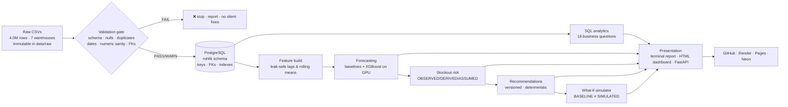
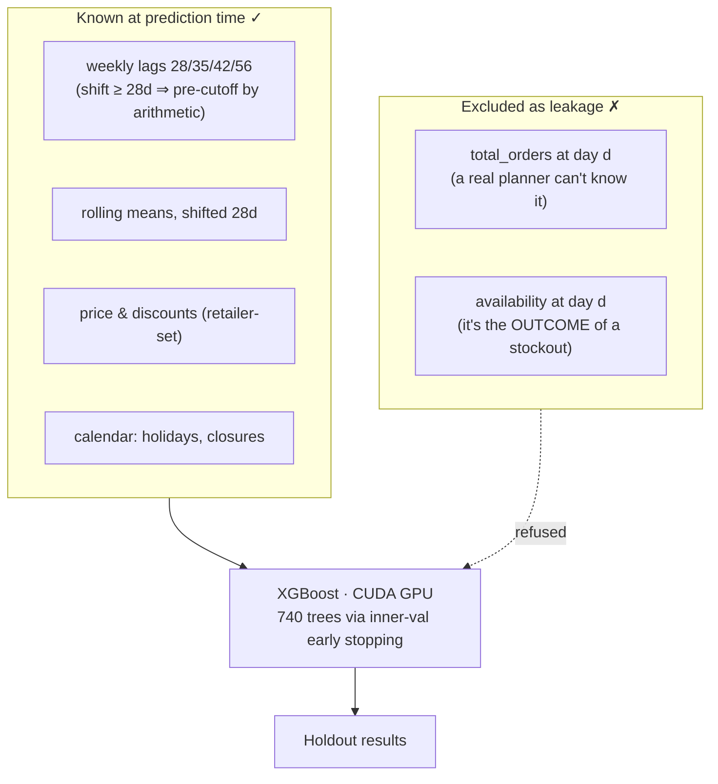
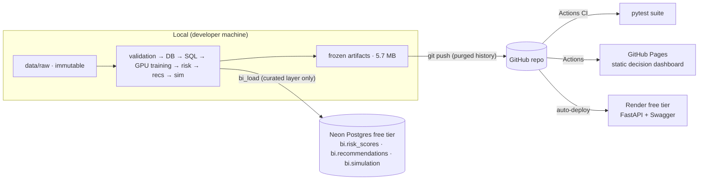

# DemandOps — Quick-Commerce Demand & Inventory Decision Platform

> Imagine you're a customer of **Blinkit**. It's 7:40 PM, you order bananas,
> paneer, and bread, and a rider is at your door by 7:52. For that to work,
> somewhere in a dark fulfillment center someone had to *know* — this morning —
> that Bananas would sell 340 units today, that the paneer shelf would run dry
> around 6 PM, and that someone should have restocked the bread by noon.
> Multiply that guess by 5,000 products and 7 fulfillment centers, every single
> day. Quick-commerce is a race where the shelf is always wrong unless a
> pipeline of data quietly decides: **how much will people demand, what will
> run out, and what should we do about it — right now?**

**DemandOps** is that pipeline, built end-to-end on real data and designed to
answer one interview question before it's asked: *"Can you turn raw data into
a decision a business person acts on — and can you prove every step?"*

**Live artifacts:** [Decision dashboard](https://adityap700.github.io/KagFint/) ·
[API](https://kagfint.onrender.com/) ·
[Interactive API docs (Swagger)](https://kagfint.onrender.com/docs)

---

## 1. Where the idea and the data come from

The setting is Blinkit-style 10-minute grocery delivery. The actual data is
the **[Rohlik Sales Forecasting Challenge v2](https://www.kaggle.com/competitions/rohlik-sales-forecasting-challenge-v2)**
— Rohlik is the Czech Republic's answer to Instacart/Blinkit: online grocery
with ~1-hour delivery, operating warehouses in Prague (×3), Brno, Budapest,
Frankfurt, and Munich. The competition ran on Kaggle with **4,007,419 daily
sales rows** (Aug 2020 – Jun 2024) across **5,390 product-warehouse series**.

Why this dataset and not a synthetic one:

| reason | what it gives the project |
|---|---|
| Real retailer, real messiness | 52 null targets, 61 missing calendar days, 32 corrupt discount values — exactly the anomalies a validation layer exists to catch |
| A genuine stockout signal | the `availability` column (fraction of a day a product was in stock) enables *observed*-data stockout risk instead of fabricated inventory |
| A public metric & weights | the competition's WMAPE metric and per-series weights make "how good is good?" answerable honestly |
| Fresh 28-day test window | the competition's own horizon becomes our evaluation protocol |

The full data profile — every column, every anomaly, every decision it
forced — lives in [`docs/DATASET.md`](docs/DATASET.md).

## 2. The pipeline: one assembly line, many checkpoints



Every station hands *validated* output to the next, and every run drops a
JSON **run manifest** (timestamp, git SHA, row counts, check results) into
`data_quality_reports/` — the paper trail that turns "trust me" into
"verify me."

## 3. The thought process, layer by layer

### 3.1 A validation gate, because dashboards lie when data lies

Before any analysis, every table must pass explicit checks: schema, missingness,
duplicates, date continuity, numeric sanity, referential integrity. The design
rule is **fail loudly, never silently repair**: findings are quantified and
preserved (e.g. *"Frankfurt_1 is missing 53 calendar days"*, *"32 rows have
discount fractions as low as −20.9"*), never quietly dropped. First real run:
**overall WARN, 0 FAILs** — and every WARN is documented in
[`docs/DATASET.md`](docs/DATASET.md).

### 3.2 PostgreSQL as the single source of truth

Plain SQL questions deserve a real database: keys, foreign keys, indexes, and
COPY-speed loading with row counts verified against the source files
(`4,007,419` exactly). Eighteen hand-written queries in
[`sql/analytics/`](sql/analytics/) answer business questions —
Friday/Saturday demand peaks (~+22%), promotions lifting sales ~36%,
~8–9 units per order, where stockout exposure concentrates — each one
documented in [`docs/SQL_CATALOG.md`](docs/SQL_CATALOG.md) with its data-grain
reasoning (finding: `total_orders` varies *within* a warehouse-day, so
order queries aggregate its daily mean — a 57× error caught and fixed).

### 3.3 Forecasting: earn the right to be fancy

The protocol is strict and non-negotiable:

- **Chronological split only** — train on the past, score on the final 28 days
  (2024-05-06 → 2024-06-02), matching the competition horizon. Time is never shuffled.
- **Baselines first** — "repeat last week's pattern" (seasonal naive) and
  "predict the recent 28-day average" (moving average) set the bar.
- **Leakage check on every feature** — *would this be known at prediction time?*



| model | WMAPE | weighted WMAPE | MAE | RMSE |
|---|---|---|---|---|
| seasonal_naive_7 | 33.7% | 47.3% | 39.5 | 124.4 |
| moving_average_28 | 31.6% | 41.3% | 37.0 | 118.3 |
| **xgboost_hist_cuda (GPU)** | **25.2%** | **31.8%** | **29.5** | **95.7** |

A ~20% relative improvement over the best baseline — and a
[test](tests/test_features.py) plants a demand spike *inside* the holdout and
proves it cannot leak into any feature.

### 3.4 Risk & recommendations: numbers with labels

The dataset has **no inventory counts and no lead times** — so the risk engine
produces availability-aware demand risk and *labels every field*:

> **OBSERVED** recent availability · **DERIVED** forecast & unmet units ·
> **ASSUMED** "future availability = recent availability" and the tier thresholds.

The recommendation engine then turns risk into instructions ("replenish ~10,405
units of Berry_1 in Prague_1") with a rule ID, an engine version, a rationale
containing its own actual numbers, and printed assumptions. Determinism is a
tested property: same inputs → same recommendations. Products with missing
telemetry get *"fix the data feed"* instead of a blind stock order.

### 3.5 What-if simulator: scenarios without lies

Levers (demand multiplier, promotion uplift, availability improvement) apply on
top of **frozen** artifacts. The baseline columns are copied and verified
untouched, history is never modified, and the identity scenario must reproduce
the risk engine's numbers *exactly* or the run aborts — a runtime consistency
gate. Notable real finding: fixing 10 points of availability absorbs a
simultaneous +20% demand surge and promotional lift (unmet units 646k → 325k).

## 4. Tech stack — and why each piece

| choice | why this and not the obvious alternative |
|---|---|
| **Python 3.11 + pandas** | the data-workflow lingua franca; the whole pipeline is reproducible scripts, not notebooks |
| **PostgreSQL 18** | real relational substrate: PKs, FKs, indexes, COPY loading — an analyst can audit the data and the SQL |
| **pytest (104 tests)** | every layer ships with its own failure-mode tests: dirty-data fixtures, leakage probes, boundary cases, determinism |
| **XGBoost (CUDA)** over LightGBM | LightGBM's Windows wheel ships *without* GPU support (verified empirically, both `device='gpu'` and `'cuda'`); XGBoost's wheel includes CUDA and trained on the RTX 4050 in ~30 s. The project plan allowed "LightGBM or another justified GBM" — the justification is recorded |
| **FastAPI** | typed endpoints + auto-generated Swagger (`/docs`) — the interactive artifact comes free |
| **rich** | the run manifest made visible: a terminal report engineers actually monitor |
| **Static HTML dashboard** | self-contained, zero dependencies, offline-safe; a dead dashboard link six months later is worse than a simple page that always renders |
| **Evidence.dev (scaffolded)** | the industry-standard markdown+SQL BI path, kept as documented future work |
| **GitHub Actions · Render · GitHub Pages · Neon** | the $0/month deployment split (below) |

## 5. Deployment: batch, static, live — correctly separated



Why this split, and why it's **$0/month with nothing that can bill you**:

| component | service | why |
|---|---|---|
| Raw data + training | **local laptop** (GPU) | 4M rows never leave the machine; training is a batch job, not a service |
| Curated decision layer | **Neon** (free Postgres) | BI/queryable layer lives in the cloud; only ~3.7k-row tables, not the raw store |
| API | **Render** (free tier) | serves frozen artifacts; sleeps after 15 min idle (~30 s cold start) — acceptable for a portfolio, honest to document |
| Dashboard | **GitHub Pages** | one static HTML file; free-forever, nothing to maintain |
| CI | **GitHub Actions** | runs the 104-test suite on every push |

**Credentials policy:** `.env` is local-only and git-ignored; cloud
credentials live in GitHub Secrets / Render's dashboard, never in the repo.
The git history itself was rewritten to purge a credential file before the
first push (see `AGENTS.md`).

## 6. Run it locally

```bash
git clone https://github.com/AdityaP700/KagFint.git && cd KagFint
python -m venv .venv
.venv/Scripts/pip install -r requirements.txt      # Windows
cp .env.example .env                                # add DATABASE_URL + Kaggle creds

# data (one-time): Kaggle competition files -> data/raw/ (immutable)
kaggle competitions download -c rohlik-sales-forecasting-challenge-v2 -p data/raw

# pipeline (sequential; training uses CUDA if present)
PYTHONPATH=src python -m demandops.pipeline         # validate
PYTHONPATH=src python -m demandops.db               # load Postgres
PYTHONPATH=src python -m demandops.sql_runner       # 18 analytics queries
PYTHONPATH=src python -m demandops.evaluate         # baselines
PYTHONPATH=src python -m demandops.train_gbm        # XGBoost on GPU
PYTHONPATH=src python -m demandops.risk             # risk scores
PYTHONPATH=src python -m demandops.recommendations  # actions
PYTHONPATH=src python -m demandops.dashboard        # static dashboard

# presentation
PYTHONPATH=src python -m demandops.report           # terminal report
PYTHONPATH=src .venv/Scripts/uvicorn demandops.api:app --port 8000  # API + /docs
```

Repo layout:

```
├── data/raw|interim|processed|external/   # immutable raw → reproducible outputs
├── data_quality_reports/                  # validation reports + run manifests
├── docs/                                  # DATASET · SQL_CATALOG · PROJECT_STORY · VALIDATION_REPORT
├── experiments/                           # baseline & GBM results, summaries
├── sql/ddl · sql/analytics/               # schema DDL · 18 business questions
├── src/demandops/                         # the pipeline (one module per layer)
├── tests/                                 # 104 tests
└── dashboard/                             # Evidence.dev scaffold (future BI path)
```

## 7. Known limitations (said out loud)

- No inventory units or lead times exist in the data → this is
  *availability-aware demand risk*, not unit-level stockout prediction; every
  ASSUMED quantity is labeled as such.
- Demand models are batch daily forecasts — not real-time streaming.
- Render's free tier sleeps; the first request after idle is slow.
- Zero-history products are forecast with a documented global-mean fallback —
  a cold-start patch, not a solution (a category-level model is the honest fix).

## 8. Docs map

[`docs/PROJECT_STORY.md`](docs/PROJECT_STORY.md) — the plain-language tour ·
[`docs/DATASET.md`](docs/DATASET.md) — data profile & anomalies ·
[`docs/SQL_CATALOG.md`](docs/SQL_CATALOG.md) — every query and why ·
[`docs/VALIDATION_REPORT.md`](docs/VALIDATION_REPORT.md) — full experiment log ·
[`AGENTS.md`](AGENTS.md) — the operating rules ·
[`CHANGELOG.md`](CHANGELOG.md) — checkpoint-by-checkpoint history.

*Credits: Rohlik Group for the competition dataset; the Kaggle community's
public notebooks for the availability-column semantics; the Blinkit framing is
narrative only — no Blinkit data was used.*
