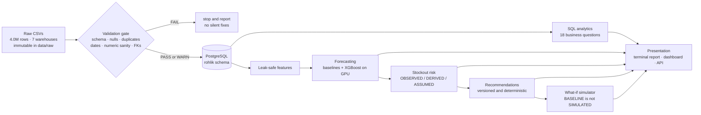
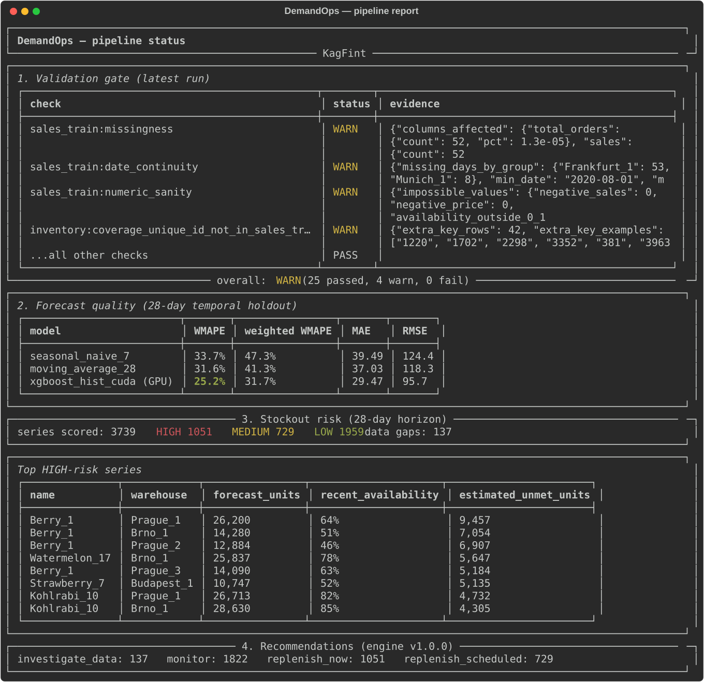
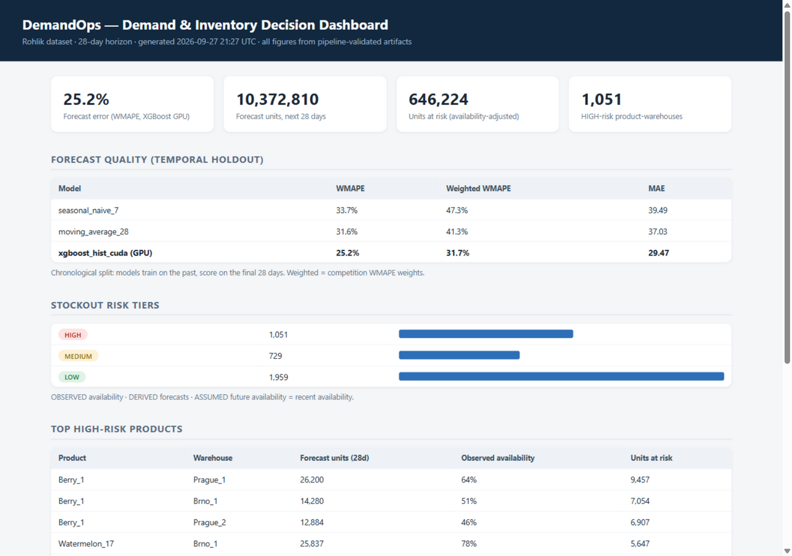
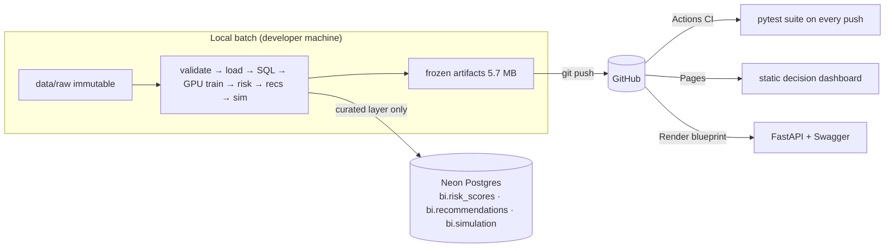

# DemandOps: From a Notebook of Orders to a Demand Platform

**Live:** [Decision dashboard](https://adityap700.github.io/KagFint/) · [API](https://kagfint.onrender.com/) · [Interactive API docs](https://kagfint.onrender.com/docs)

---

## Chapter 1: The customer

Imagine you are a customer of [Blinkit](https://en.wikipedia.org/wiki/Blinkit).
It is 7:40 in the evening. You order bananas, paneer, and bread. A rider rings
your bell at 7:52. Ten minutes, give or take.

You never see the part that made it possible. Somewhere in a dark store, a few
hours earlier, someone had to *know* that Bananas would sell ~340 units today,
that the paneer shelf would empty around 6 PM, and that bread should have been
restocked by noon. Multiply that by 5,000 products and 7 fulfillment centers,
every single day, and you get the real job behind the 10-minute promise.

Quick commerce works like this all over the world, from Blinkit in India to
[Rohlik](https://www.rohlikgroup.com/) in Central Europe, and it runs on the
same three questions asked daily at scale:

1. **How much will people demand tomorrow?** (forecasting)
2. **What is about to run out?** (stockout risk)
3. **What should we do about it, today?** (recommendations)

This project is a working answer to those questions, built on real data, and
designed so that every number can survive the question "how do you know?"

## Chapter 2: Twenty notebooks do not scale

Here is the hypothetical that motivated the whole design. Suppose *you*
personally manage groceries for a few families in your neighborhood. Twenty
regulars, forty products, one notebook. You know Mrs. Sharma buys bananas
every second day. When prices change you remember. The notebook **is** the
analytics, and it works.

Now scale it. A few hundred families later you add two more helpers, and the
notebook stops being one person's memory. A thousand families later you open a
dark store, and strange things start happening that no notebook predicted:

- **The bananas case.** Demand did not drop. The shelf did. Your sales history
  quietly records "0 units sold" on days when people *wanted* bananas and
  could not get them. If you train on that history blindly, you learn that
  Sundays have no banana demand. That is a lie your own data tells you.
- **The promotion case.** You discount paneer 30% and sales jump. Was it the
  discount, the weekend, the weather? With a few hundred rows you guess. With
  4 million rows you had better *know*.
- **The missing Tuesday case.** One store's data simply stops for two months.
  Was it closed? Renovated? A sensor failure? Nobody wrote it down.
- **The impossible value case.** A discount of −2094% appears in the file.
  Somebody's export glitched. If your pipeline multiplies that silently, every
  downstream number is quietly poisoned.

At 5,390 products, 7 warehouses, and 4 years of daily history, you are no
longer managing groceries. You are managing a *dataset about groceries*, and
the dataset has opinions, gaps, and lies. This project is what it takes to
answer the three questions above anyway, with real data from
Rohlik's public [Kaggle competition](https://www.kaggle.com/competitions/rohlik-sales-forecasting-challenge-v2)
(the Czech quick-commerce company; same model, different country), and it is
built so a sceptical interviewer can audit every step.

## Chapter 3: The assembly line



### Chapter 3.1: Trust the data, or make it confess

Before any analysis, the raw files face explicit checks: schema, missingness,
duplicates, date continuity, numeric sanity, referential integrity. The rule
is **fail loudly, never silently repair**. The first real run confessed
immediately: 52 rows with missing sales, 61 missing calendar days across two
warehouses, 32 rows with discount fractions as low as minus 20.9, and 42
products that exist only as catalog metadata. Every finding is quantified in
[`docs/DATASET.md`](docs/DATASET.md) and preserved, never dropped to make a
metric look nicer.

### Chapter 3.2: Ask the boring questions first

Eighteen hand-written queries in [`sql/analytics/`](sql/analytics/) answer
questions a category manager would actually ask. Do weekends sell more?
(Yes: ~+22% versus Monday.) Do promotions work? (Yes: ~+36% on average.)
How many units were plausibly lost to empty shelves? (An upper-bound
*estimate*, labeled as an estimate.) Each query is documented with its data
grain in [`docs/SQL_CATALOG.md`](docs/SQL_CATALOG.md), including a subtle
catch: the order-count column varies *within* a single warehouse-day, so
summing it naively inflated results 57-fold until the query design was fixed.

### Chapter 3.3: Predict, but earn the right to be fancy

Two honest yardsticks go first: "repeat last week's pattern" and "predict the
recent 28-day average." Evaluation is strictly chronological: train on the
past, score on the final 28 days, which matches the competition's own horizon.
Time is never shuffled.

Then the machine-learning model earns its place through a leak-proof feature
contract. Every feature must answer one question: *would this be known at
prediction time?* Weekly lags and rolling means are shifted by at least 28
days, so no feature can read the future **by arithmetic, not by promise**.
Warehouse order totals and shelf availability are *excluded* as leakage
(availability is the outcome of a stockout, not an input). A test plants a
demand spike inside the holdout and proves it cannot appear in any feature.

| model | WMAPE | weighted WMAPE | MAE | RMSE |
|---|---|---|---|---|
| seasonal naive (lag 7) | 33.7% | 47.3% | 39.5 | 124.4 |
| moving average (28d) | 31.6% | 41.3% | 37.0 | 118.3 |
| **XGBoost (CUDA GPU)** | **25.2%** | **31.8%** | **29.5** | **95.7** |

Why XGBoost and not LightGBM? The plan allowed either. LightGBM's Windows
wheel ships without GPU support (verified by running it, not by reading a
blog), while XGBoost's wheel includes CUDA and trained on this laptop's RTX
4050 in about 30 seconds. The justification is written into the code and the
changelog, so the choice survives scrutiny.

### Chapter 3.4: From forecasts to "what do we do?"

The dataset contains **no inventory counts and no lead times**, so the risk
engine never pretends otherwise. Instead it scores every series with labels:

> **OBSERVED** recent shelf availability · **DERIVED** forecast and unmet
> units · **ASSUMED** "future availability looks like recent availability"
> and the tier thresholds.

The recommendation engine turns risk into plain instructions, versioned like
production software. Every row carries a rule ID, an engine version, its own
actual numbers, and its printed assumptions. A product with missing telemetry
gets "fix the data feed" rather than a blind stock order. Determinism is a
tested property, not a hope.

### Chapter 3.5: Rehearse the future without touching the past

The simulator answers "what if demand surges 20% for the holidays and we also
fix a tenth of the availability shortfall?" It runs on frozen artifacts, the
baseline columns are verified untouched, and the do-nothing scenario must
reproduce the risk engine's numbers *exactly* or the run aborts. On real data
the availability fix absorbs the entire surge: projected unmet units fall from
646k to 325k. Fixing the shelf beats fighting the demand curve.

## Chapter 4: What it looks like

The terminal report (the run manifest made visible):



The decision dashboard (one self-contained HTML file, also served by the API):



And the API documents itself, so anyone can query live data at
`/docs` without reading a line of code.

## Chapter 5: The deployment split

Batch, static, and live workloads have different shapes, so they live in
different (free) homes:



The reasoning: training is a batch job, so it stays on the laptop's GPU and
the 4M raw rows never need cloud hosting. Only the small decision layer
(three tables of ~3,700 rows) lives on Neon's free Postgres. The API serves
frozen artifacts from Render's free tier and sleeps when idle. The dashboard
is a single static file on GitHub Pages. Total cost: **$0/month, with no
service that can generate a bill.** Cloud credentials exist only in GitHub
Secrets and Render's dashboard; the git history itself was rewritten to purge
a credential file before the first push.

## Chapter 6: Run it yourself

```bash
git clone https://github.com/AdityaP700/KagFint.git && cd KagFint
python -m venv .venv
.venv/Scripts/pip install -r requirements.txt      # Windows
cp .env.example .env                                # add DATABASE_URL + Kaggle creds

# data (one-time): competition files -> data/raw/ (immutable)
kaggle competitions download -c rohlik-sales-forecasting-challenge-v2 -p data/raw

# the pipeline, in order
PYTHONPATH=src python -m demandops.pipeline         # validate
PYTHONPATH=src python -m demandops.db               # load Postgres
PYTHONPATH=src python -m demandops.sql_runner       # 18 analytics queries
PYTHONPATH=src python -m demandops.evaluate         # baselines
PYTHONPATH=src python -m demandops.train_gbm        # XGBoost on GPU
PYTHONPATH=src python -m demandops.risk             # risk scores
PYTHONPATH=src python -m demandops.recommendations  # actions
PYTHONPATH=src python -m demandops.dashboard        # static dashboard

# presentation
PYTHONPATH=src python -m demandops.report           # terminal report
PYTHONPATH=src .venv/Scripts/uvicorn demandops.api:app --port 8000  # API + /docs
```

Repo layout:

```
├── data/raw|interim|processed|external/   # immutable raw → reproducible outputs
├── data_quality_reports/                  # validation reports + run manifests
├── docs/                                  # DATASET · SQL_CATALOG · PROJECT_STORY · VALIDATION_REPORT
├── experiments/                           # baseline & GBM results, summaries
├── sql/ddl · sql/analytics/               # schema DDL · 18 business questions
├── src/demandops/                         # the pipeline, one module per layer
├── tests/                                 # 104 tests
└── dashboard/                             # Evidence.dev scaffold (future BI path)
```

## Chapter 7: What I would do next

- A category-level cold-start model, replacing the documented global-mean
  fallback for brand-new products.
- Real inventory and lead-time data, which would upgrade the risk engine from
  availability-aware to true unit-coverage replenishment.
- The [Evidence.dev](https://docs.evidence.dev/) BI layer, already scaffolded
  in `dashboard/`, once its SvelteKit build quirk is resolved.

## Docs map

[`docs/PROJECT_STORY.md`](docs/PROJECT_STORY.md) (the plain-language tour) ·
[`docs/DATASET.md`](docs/DATASET.md) (data profile and anomalies) ·
[`docs/SQL_CATALOG.md`](docs/SQL_CATALOG.md) (every query and why) ·
[`AGENTS.md`](AGENTS.md) (operating rules) ·
[`CHANGELOG.md`](CHANGELOG.md) (checkpoint history).

*Credits: the Rohlik Group published the competition dataset; Kaggle's
community notebooks clarified the availability-column semantics; the Blinkit
narrative is a framing device only, no Blinkit data was used. Articles that
shaped the thinking: [dark stores](https://en.wikipedia.org/wiki/Dark_store),
[quick commerce](https://en.wikipedia.org/wiki/Quick_commerce), and the
[WMAPE metric](https://en.wikipedia.org/wiki/Mean_absolute_percentage_error)
the competition scored on.*
